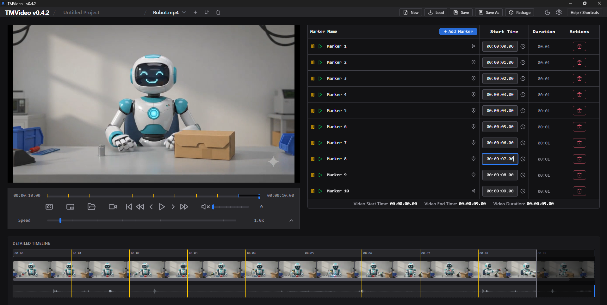
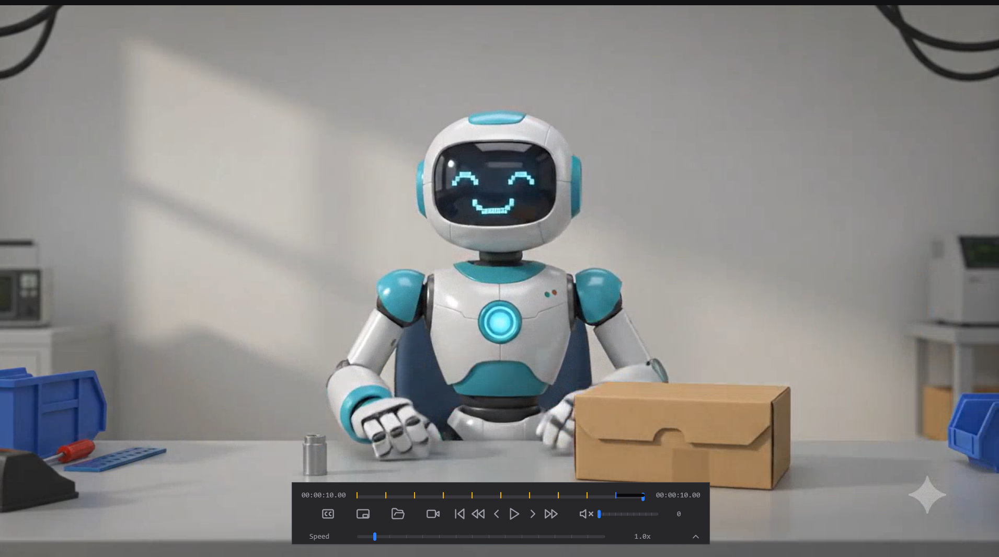
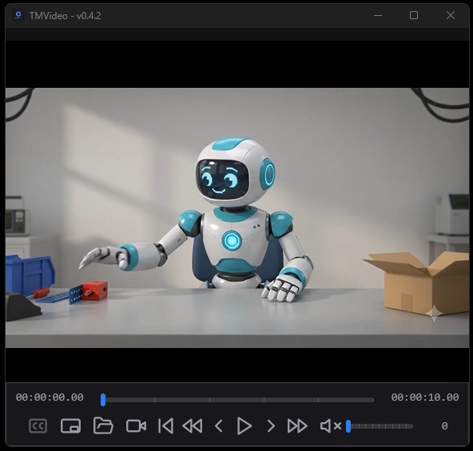
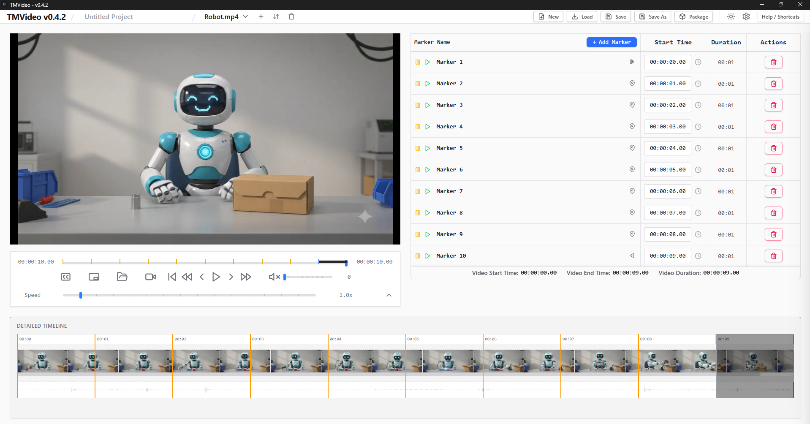

# TMVideo

[](https://github.com/57471C/TMVideo/blob/main/LICENSE)

TMVideo is a premium, high-performance chapter bookmarking, timeline review, and video annotation tool. Built with a fast, frameworkless Vanilla JS/CSS frontend and a lightweight **Rust Tauri** backend, it bypasses standard browser sandbox memory limits to load and parse production-grade video assets instantly. 

The application utilizes local asset streams backed by a custom secure proxy pipeline, avoiding browser compilation lag while rendering frame-accurate timeline annotations.

---

## Unified Workspace View Profiles

TMVideo features a strict, class-driven modal state machine (`normal-mode`, `cinema-mode`, and `miniplayer-mode`) managed seamlessly via plain CSS selectors on the `<body>` element. This eliminates manual inline JavaScript style pollution and prevents layout side-effects.

### 1. Normal Workspace (Editing Dashboard)
The complete multi-column workspace environment built for asset management, timeline indexing, and marker mapping.
* **Layout Grid:** Active sidebars (playlist queue and detailed editing lanes) alongside an embedded data matrix table.
* **Aesthetic:** Styled using a premium, low-glare off-black canvas theme (`#121214`).



### 2. Cinema Mode (Focused Review)
An absolute fullscreen, distraction-free environment optimized for high-velocity timeline review.
* **Window Behavior:** Leverages native Tauri window execution loops to enter absolute device fullscreen mode.
* **Interface:** Blasts away all playlists, control sidebars, margins, and data tables. The video asset automatically blows up to fill the device boundaries.
* **Controls Deck:** Interactive player mechanics float as an absolute centered overlay that automatically fades out of sight after 5 seconds of keyboard or mouse inactivity.



### 3. Miniplayer Mode (Floating Compact Widget)
A sleek, float-locked media companion designed to hover on top of your editing environment or secondary view screen.
* **Window Behavior:** Scales the physical window border frame automatically to a sleek widget footprint (`580px x 480px`), strips native maximize/minimize anchors, and locks the application to `AlwaysOnTop`.
* **Interface Mechanics:** Drops sidebars and indexes, pinning the primary playback buttons cleanly and flush against the bottom edge of the visible window.



*The interface fully supports a clean fallback layer for light-themed operational setups.*


---

## Native OS Launch Subsystem

The application features deep Windows registry integration for automatic workspace routing depending on what file format you open directly from your operating system explorer context:

* **Raw Video Files (`.mp4`, `.avi`, `.mkv`, `.mov`, `.mpg`):** Double-clicking directly launches the app as a compact, floating **Miniplayer Widget** on top of your workspace, immediately processing the video stream.
* **Project Files & Data Tables (`.tmv`, `.tmvz`):** Double-clicking instantly expands into a maximized **Normal Workspace**, automatically rehydrating all historical timeline markers, timestamps, metadata, and visual track layouts.
* **Cold Boots:** Launching the app directly without parameters forces a clean maximized state into a fresh, empty workspace session.

---

## Technical Architecture & Timeline Tracks

TMVideo values speed and minimalism, entirely avoiding heavy third-party framework layers (such as Peaks.js or Wavesurfer.js) or cloud transcription weights.

* **High-Performance Canvas Timeline:** Audio tracks and video filmstrips are rendered using low-level, pure HTML5 2D canvas drawings, enabling lag-free frame lookups.
* **Isolated DOM Component Purging:** The application relies on a strict lifecycle separation. Standalone `.tmv` data imports only swap marker data points, preserving your running visual timeline. True project switches or "New Project" resets perform clean canvas context wipes (`ctx.clearRect`) and empty image buffers without destroying core structural DOM layouts.
* **Code Health & Compilation:** Code validation is enforced via the high-speed **Biome compiler toolchain** to maintain syntax uniformity across all tracking engines.

---

## Installation & Active Development

### Prerequisites
* [Node.js](https://nodejs.org/) (v18+ recommended)
* [Rust Toolchain](https://www.rust-lang.org/) (via `rustup`)

### Setup Loop
1. Clone the master directory:
   ```bash
   git clone [https://github.com/57471C/TMVideo.git](https://github.com/57471C/TMVideo.git)
   cd TMVideo
   ```

2. Ingest required node packages:
   ```bash
   npm install
   ```

3. Boot up the local hot-reloading development system:
   ```bash
   npx tauri dev
   ```

4. Run code formatting and syntax compliance analyses:
   ```bash
   npx biome check . --write
   ```


---
## Detailed Changelog

### v0.4.2
Added: Context-specific target execution mapping to accept explicit view parameters inside window.cycleViewMode.

Added: Upgraded OS launch argument subsystem to route raw media assets into floating mini-widgets and serialized files into maximized edit panels.

Updated: Transformed full application theme canvas background from harsh high-contrast black (#000000) to premium off-black (#121214).

Fixed: Fixed a timeline bug by separating standalone text metadata loads from destructive video lifecycle purges.

### v0.4.1
Refactored: Overhauled view carousel state tracking to rely completely on body-level CSS modifiers, resolving an unhandled JavaScript ReferenceError during Cinema mode execution blocks.

Fixed: Restored missing media playback controls and corrected rigidity constraints blocking video resizing inside the compact miniplayer window.

### v0.2.2
Added: Implemented native OS file associations and automated blank project initializers for passed external media files.

### v0.1.0
Migrated: Migrated application framework from older multi-lane video editing tracks to focus strictly on high-performance media playback and precise canvas marker annotations.

License: Distributed under the MIT Open-Source parameters. Created and maintained by 57471C.